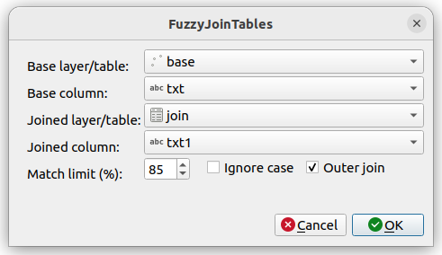

# Fuzzy Join Tables

Plugin for QGIS to join two tables on maximal fuzzy match.

Using fuzzy join we can join tables on inexact match. It can be used to
find matching records even spelling errors are present. The result is a memory layer
which has the geometry of the first layer (if there is any) and the attributes 
from both layers plus the match rate.

This plugin uses Damerau-Levenshtein edit distance, see
https://en.wikipedia.org/wiki/Damerau-Levenshtein_distance. QGIS has a
Levenshtein distance function which considers insert, delete and replace
operations. Damerau-Levenshtein distance adds a fours operation the
transposition when the order of the adjecent is wrong (e.g.
hte -> the).

## Usage

The plugin adds an option to the **Vector** menu and an icon to the
Plugins Toolbar. Starting the plugin an dialog box apears on the screen.

**Base layer/Table**

> The name of the vector layer or table to join to, select from the pull down list

**Base column**

> Select the field to join to, you can use any type of column, but the plugin will make string comparison of values

**Joined layer/table**

> The name of the layer or table to join to the base table, select from the pull down list

**Joined column**

> Select the field to join to base column, you can use any type of column, but the plugin will make string comparison of values

**Match limit (%)**

> Set the acceptable match rate in percents

**Ignore case**

> If checked a case insensitive compare of strings will be used

**Outter join**

> If checked a left outer join will be created, all rows from the base table will be coppied to the result table even no matching record found in joined layer/table

Pressing the **OK** buttom a new memory layer is added to the layer list, called
*FuzzyJoin*. The features of the layer inherit the geometry from the base layer
and have attributes from both tables. The column names of the joined table are
changed by adding *joined_* prefix to avoid duplicate column names.
An extra column is added called 
*joined_match*, which stores the matching ratio (1 is the perfect match).

## An example

We have two small tables both containing postal adresses (from Hungary)
with spalling mistakes.

**Base table**

| id | txt                  |
| -- | -------------------- |
|  1 | Karcag utca 37.      |
|  2 | Kunhegyes utca 2.    |
|  3 | Derzsi utca 43       |
|  4 | Szalóki utca 24.     |

**Joined table**

| id | txt1                 |
| -- | -------------------- |
|  1 | Karczag utca 35.     |
|  2 | KunHegyes u. 2       |
|  3 | Derzs utca 40.       |
|  4 | Szaloky utca 24.     |

Fuzzy joining the the two tables using txt and txt1 columns with 85%
limit, case sensitive inner join, we get the following table:

| id | txt                  | joined_id | joined_txt1      | joined_match |
| -- | -------------------- | --------- | ---------------- | ------------ |
|  1 | Karcag utca 37.      |         1 | Karczag utca 35. | 0.875        |
|  4 | Szalóki utca 24.     |         4 | Szaloky utca 24. | 0.875        |

Fuzzy joining the the two tables using txt and txt1 columns with
85% limit, case sensitive left outer join, we get the following table:

| id | txt                  | joined_id | joined_txt1      | joined_match |
| -- | -------------------- | --------- | ---------------- | ------------ |
|  1 | Karcag utca 37.      |         1 | Karczag utca 35. | 0.875        |
|  2 | Kunhegyes utca 2.    |           |                  | 0.706        |
|  3 | Derzsi utca 43       |           |                  | 0.786        |
|  4 | Szalóki utca 24.     |         4 | Szaloky utca 24. | 0.875        |

Fuzzy joining the the two tables using txt and txt1 columns with
75% limit, case sensitive left outer join, we get the following table:

| id | txt                  | joined_id | joined_txt1      | joined_match |
| -- | -------------------- | --------- | ---------------- | ------------ |
|  1 | Karcag utca 37.      |         1 | Karczag utca 35. | 0.875        |
|  2 | Kunhegyes utca 2.    |           |                  | 0.706        |
|  3 | Derzsi utca 43       |         3 | Derzs utca 40.   | 0.786        |
|  4 | Szalóki utca 24.     |         4 | Szaloky utca 24. | 0.875        |

Fuzzy joining the the two tables using txt and txt1 columns with
75% limit, case insensitive left outer join, we get the following table:

| id | txt                  | joined_id | joined_txt1      | joined_match |
| -- | -------------------- | --------- | ---------------- | ------------ |
|  1 | Karcag utca 37.      |         1 | Karczag utca 35. | 0.875        |
|  2 | Kunhegyes utca 2.    |         2 | KunHegyes u. 2   | 0.765        |
|  3 | Derzsi utca 43       |         3 | Derzs utca 40.   | 0.786        |
|  4 | Szalóki utca 24.     |         4 | Szaloky utca 24. | 0.875        |
